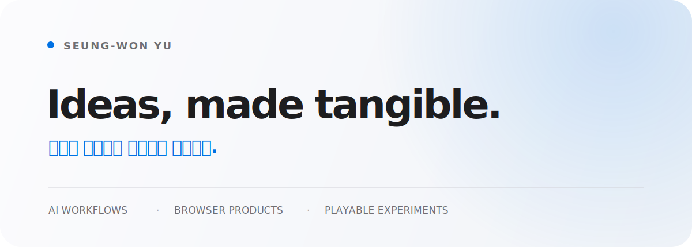

<picture>
  <source media="(prefers-color-scheme: dark) and (max-width: 600px)" srcset="./assets/profile-hero-mobile-dark.svg" />
  <source media="(max-width: 600px)" srcset="./assets/profile-hero-mobile-light.svg" />
  <source media="(prefers-color-scheme: dark)" srcset="./assets/profile-hero-dark.svg" />
  <source media="(prefers-color-scheme: light)" srcset="./assets/profile-hero-light.svg" />
  
</picture>

<p align="center">
  <a href="https://seung-won-yu.github.io/codex-agent-kit/">Codex setup</a>
  &nbsp;·&nbsp;
  <a href="https://seung-won-yu.github.io/pocket-desk-os/">Latest product</a>
  &nbsp;·&nbsp;
  <a href="https://github.com/Seung-Won-Yu?tab=repositories">All projects</a>
</p>

## What I make

아이디어를 설명에만 남겨두지 않고, 직접 만지고 실행할 수 있는 결과물로 만듭니다.

- **AI workflows** — 거친 요청을 명확한 실행과 검증으로 연결하는 에이전트 운영 체계
- **Browser-native products** — 설치 없이 바로 경험할 수 있는 인터랙티브 웹 제품
- **Playable experiments** — 짧게 시작해 완성도 있는 플레이 흐름으로 발전시키는 게임 프로토타입

## Selected work

### 01 · Codex Agent Kit

실제로 사용하는 개인 Codex 설정의 source of truth. 거친 요청 보정, native skill routing, 제한된 에이전트 위임과 최종 검증을 하나의 설치 흐름으로 정리했습니다.  
**[View live](https://seung-won-yu.github.io/codex-agent-kit/)** · [Source](https://github.com/Seung-Won-Yu/codex-agent-kit)

### 02 · PocketDesk OS

창 관리자, 파일 시스템, 메모장, 그림판과 게임까지 브라우저 안에서 실제로 동작하는 React 기반 웹 데스크톱입니다.  
**[Open desktop](https://seung-won-yu.github.io/pocket-desk-os/)** · [Source](https://github.com/Seung-Won-Yu/pocket-desk-os)

### 03 · Rune Drift Survivors

React Three Fiber로 만든 3D 브라우저 로그라이트. 자동 전투, 성장 선택, 시너지와 보스전이 하나의 5분 플레이 루프로 이어집니다.  
**[Play game](https://seung-won-yu.github.io/rune-drift-survivors/)** · [Source](https://github.com/Seung-Won-Yu/rune-drift-survivors)

### 04 · Apple Burst

합이 10이 되는 사과를 드래그해 터뜨리는 캐주얼 브라우저 게임. 반응형 캔버스와 Firebase 기반 랭킹 흐름을 갖췄습니다.  
**[Play game](https://seung-won-yu.github.io/apple-burst/)** · [Source](https://github.com/Seung-Won-Yu/apple-burst)

## How I work

```text
rough idea → clear scope → working slice → browser verification → documented release
```

빠르게 만드는 것보다, 실제로 동작하고 다시 설명할 수 있는 상태까지 마무리하는 것을 중요하게 생각합니다.

`TypeScript` · `React` · `Vite` · `Three.js` · `Firebase` · `Supabase` · `Python` · `GitHub Actions`

---

<p align="center">
  <sub>Small ideas, thoughtfully shipped.</sub>
</p>
