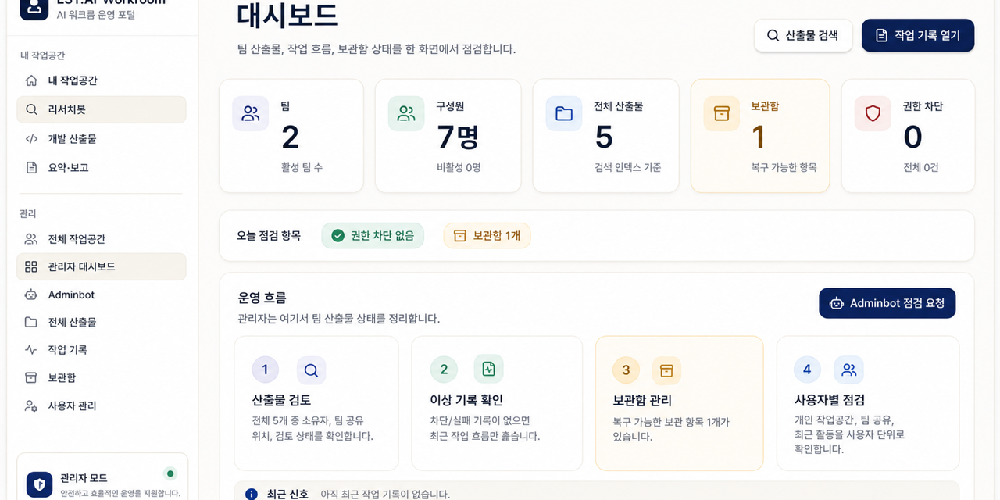

<!-- GitHub profile README for Seung-Won Yu -->

<p align="left">
  
</p>



# 유승원 · Seung-Won Yu

I build small playable web games, AI-assisted work tools, and practical prototypes that can become real portfolio pieces.

```text
idea -> playable prototype -> cleaner README -> portfolio-ready project
```

## Focus

- Browser games with clear feedback loops and ranking-ready structure
- AI workroom tools for research, file previews, artifacts, sharing, and admin flows
- Codex agent setup: lean skills, routing rules, senior engineering lenses, and repeatable workflows
- Project presentation: README structure, preview images, badges, and GitHub polish

## Stack

**Main**

[](https://skillicons.dev)

**Learning / expanding**

[](https://skillicons.dev)

## Featured Builds

### EST.AI Workroom Portal

Private internal workroom portal for AI artifacts, research outputs, file previews, team sharing, archive recovery, and admin operations.


### Playable Games

<table>
  <tr>
    <td width="50%">
      <a href="https://github.com/Seung-Won-Yu/pangpang-anipang">
        
      </a>
    </td>
    <td width="50%">
      <a href="https://github.com/Seung-Won-Yu/apple-burst">
        
      </a>
    </td>
  </tr>
  <tr>
    <td width="50%">
      <strong><a href="https://github.com/Seung-Won-Yu/pangpang-anipang">PangPang Anipang</a></strong><br />
      Match-style web game prototype built with React, TypeScript, Vite, and Firebase.
    </td>
    <td width="50%">
      <strong><a href="https://github.com/Seung-Won-Yu/apple-burst">Apple Burst</a></strong><br />
      Static browser apple-burst game with optional Firebase ranking.
    </td>
  </tr>
</table>

### Codex Agent Kit

<a href="https://github.com/Seung-Won-Yu/codex-agent-kit">
  
</a>

My personal Codex setup for turning rough requests into cleaner execution:

- 102 lean skills instead of a noisy skill pile
- `skill-router` for fast routing by task type
- `media-image-director` for Codex-native image prompts and README visuals
- senior engineering lenses for backend, frontend, review, and ship checks

## Project Links

<p>
  <a href="https://github.com/Seung-Won-Yu/pangpang-anipang">
    
  </a>
  <a href="https://github.com/Seung-Won-Yu/apple-burst">
    
  </a>
  <a href="https://github.com/Seung-Won-Yu/codex-agent-kit">
    
  </a>
  <a href="https://github.com/Seung-Won-Yu?tab=repositories">
    
  </a>
</p>

## Contribution Skyline

<picture>
  <source media="(prefers-color-scheme: dark)" srcset="./profile-3d-contrib/profile-night-rainbow.svg" />
  <source media="(prefers-color-scheme: light)" srcset="./profile-3d-contrib/profile-season-animate.svg" />
  
</picture>
