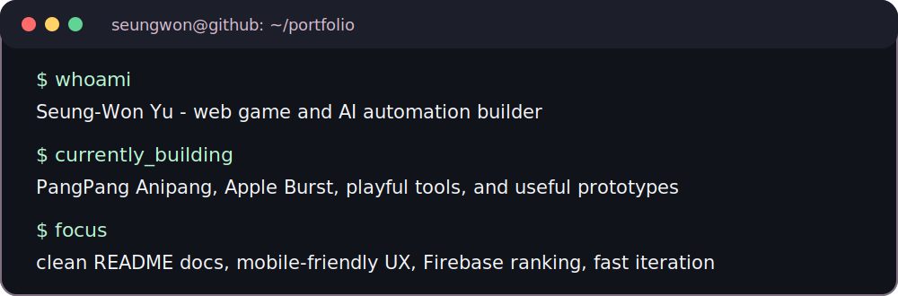
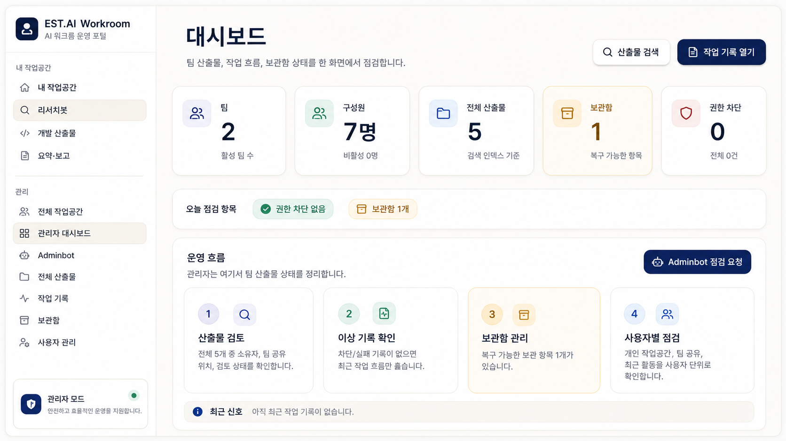
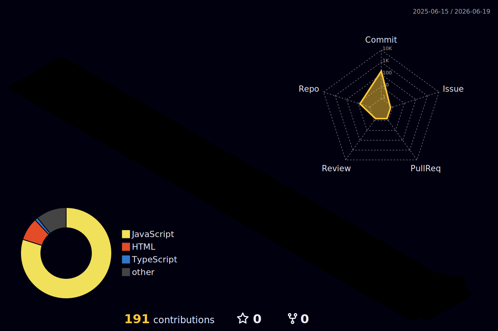

<!-- GitHub profile README for Seung-Won Yu -->

<p align="right">
  
</p>

<h1 align="center">유승원 · Seung-Won Yu</h1>

<p align="center">
  Web games, AI-assisted work tools, and portfolio-ready prototypes.
</p>

<p align="center">
  <a href="https://github.com/Seung-Won-Yu?tab=repositories">
    
  </a>
  <a href="https://github.com/Seung-Won-Yu/codex-agent-kit">
    
  </a>
  <a href="https://github.com/Seung-Won-Yu/pangpang-anipang">
    
  </a>
</p>



## What I Build

```text
small idea -> playable prototype -> cleaner UX -> polished README -> portfolio piece
```

| Focus | What it means |
| --- | --- |
| Playable web games | Match loops, simple feedback, ranking-ready structure, mobile-friendly interaction |
| AI workroom tools | Research flows, file previews, artifacts, archive recovery, sharing, admin operations |
| Codex agent setup | Lean skills, routing rules, image direction, senior engineering review gates |
| Project polish | Better READMEs, preview images, badges, screenshots, and GitHub presentation |

## Stack

<p>
  <a href="https://skillicons.dev">
    
  </a>
</p>

## Selected Work

### EST.AI Workroom Portal

Private internal workroom portal for AI artifacts, research outputs, file previews, team sharing, archive recovery, and admin operations.



### Playable Browser Games

<table>
  <tr>
    <td width="50%">
      <a href="https://github.com/Seung-Won-Yu/pangpang-anipang">
        
      </a>
    </td>
    <td width="50%">
      <a href="https://github.com/Seung-Won-Yu/apple-burst">
        
      </a>
    </td>
  </tr>
  <tr>
    <td width="50%">
      <strong><a href="https://github.com/Seung-Won-Yu/pangpang-anipang">PangPang Anipang</a></strong><br />
      React, TypeScript, Vite, Firebase<br />
      Match-style web game prototype with Firebase-backed structure.
    </td>
    <td width="50%">
      <strong><a href="https://github.com/Seung-Won-Yu/apple-burst">Apple Burst</a></strong><br />
      HTML, JavaScript, optional Firebase ranking<br />
      Static browser apple-burst game focused on quick play and score flow.
    </td>
  </tr>
</table>

### Codex Agent Kit

<a href="https://github.com/Seung-Won-Yu/codex-agent-kit">
  
</a>

Personal Codex setup for turning rough requests into cleaner execution:

- 102 lean skills instead of a noisy skill pile
- fast `skill-router` paths by task type
- `media-image-director` for Codex-native image prompts and README visuals
- senior engineering lenses for backend, frontend, review, and ship checks

## Quick Links

<p>
  <a href="https://github.com/Seung-Won-Yu/pangpang-anipang">
    
  </a>
  <a href="https://github.com/Seung-Won-Yu/apple-burst">
    
  </a>
  <a href="https://github.com/Seung-Won-Yu/codex-agent-kit">
    
  </a>
  <a href="https://github.com/Seung-Won-Yu?tab=repositories">
    
  </a>
</p>

## Contribution Skyline

<picture>
  <source media="(prefers-color-scheme: dark)" srcset="./profile-3d-contrib/profile-night-rainbow.svg" />
  <source media="(prefers-color-scheme: light)" srcset="./profile-3d-contrib/profile-season-animate.svg" />
  
</picture>
