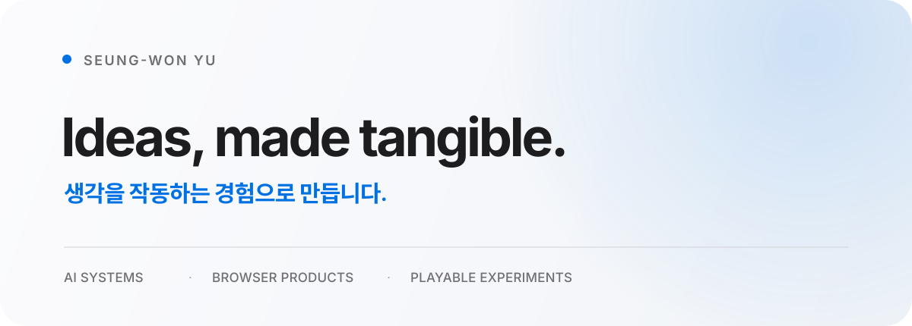

<picture>
  <source media="(prefers-color-scheme: dark) and (max-width: 600px)" srcset="./assets/profile-hero-mobile-dark.svg" />
  <source media="(max-width: 600px)" srcset="./assets/profile-hero-mobile-light.svg" />
  <source media="(prefers-color-scheme: dark)" srcset="./assets/profile-hero-dark.svg" />
  <source media="(prefers-color-scheme: light)" srcset="./assets/profile-hero-light.svg" />
  
</picture>

<p align="center">
  <a href="https://seung-won-yu.github.io/codex-agent-kit/">Codex setup</a>
  &nbsp;·&nbsp;
  <a href="https://seung-won-yu.github.io/pocket-desk-os/">Latest product</a>
  &nbsp;·&nbsp;
  <a href="https://github.com/Seung-Won-Yu?tab=repositories">All projects</a>
</p>

## What I make

아이디어를 설명에만 남겨두지 않고, 직접 만지고 실행할 수 있는 결과물로 만듭니다.
그리고 만든 것이 **정말 동작하는지 스스로 증명하는 구조**까지가 완성이라고 생각합니다.

- **AI systems** — 판단을 기록하고, 규칙이 바뀌면 표본을 버리고, 독립 감사를 반복 투입하는 검증 가능한 자동화
- **Browser-native products** — 설치 없이 바로 경험할 수 있는 인터랙티브 웹 제품
- **Playable experiments** — 짧게 시작해 완성도 있는 플레이 흐름으로 발전시키는 게임 프로토타입

## Selected work

<table>
<tr>
<td width="50%" valign="top">

### 01 · edgelab

  

미국주식 4전략 모의투자 검증 랩. 실주문 경로가 없는 paper-only 구조에서
모든 판단을 불변 저널에 남기고, 규칙이 바뀌면 성적표를 0에서 다시
씁니다(파라미터 세대 분리). 보수적 가상체결 · 거래일 캘린더 기반 시세
두절 방어 · USD 손익 판정 · **285+ 회귀 테스트**. 내부 에이전트와 외부
모델을 감사자로 반복 투입해 발견을 코드 대조로 판정·반영합니다.

</td>
<td width="50%" valign="top">

### 02 · AIVIS

  

AI 기반 산업안전 통합 관제 시스템. PPE(보호구) 착용·낙상 감지, 얼굴
식별, 실시간 대시보드를 하나의 관제 흐름으로 묶었습니다.

</td>
</tr>
<tr>
<td width="50%" valign="top">

### 03 · [autolabel](https://github.com/Seung-Won-Yu/autolabel)

 

프롬프트 한 줄에서 전용 모델까지 — 로컬에서 돌아가는 오토라벨링 도구.
Grounding DINO + SAM 으로 라벨을 만들고 자동 파인튜닝까지 이어집니다.

**[Source ↗](https://github.com/Seung-Won-Yu/autolabel)**

</td>
<td width="50%" valign="top">

### 04 · [Codex Agent Kit](https://seung-won-yu.github.io/codex-agent-kit/)

 

실제로 사용하는 개인 Codex 설정의 source of truth. 거친 요청 보정,
native skill routing, 제한된 에이전트 위임과 최종 검증을 하나의 설치
흐름으로 정리했습니다.

**[View live ↗](https://seung-won-yu.github.io/codex-agent-kit/)** · [Source](https://github.com/Seung-Won-Yu/codex-agent-kit)

</td>
</tr>
<tr>
<td width="50%" valign="top">

### 05 · [PocketDesk OS](https://seung-won-yu.github.io/pocket-desk-os/)

  

창 관리자, 파일 시스템, 메모장, 그림판과 게임까지 브라우저 안에서
실제로 동작하는 React 기반 웹 데스크톱입니다.

**[Open desktop ↗](https://seung-won-yu.github.io/pocket-desk-os/)** · [Source](https://github.com/Seung-Won-Yu/pocket-desk-os)

</td>
<td width="50%" valign="top">

### 06 · [Rune Drift Survivors](https://seung-won-yu.github.io/rune-drift-survivors/)

  

React Three Fiber로 만든 3D 브라우저 로그라이트. 자동 전투, 성장 선택,
시너지와 보스전이 하나의 5분 플레이 루프로 이어집니다.

**[Play game ↗](https://seung-won-yu.github.io/rune-drift-survivors/)** · [Source](https://github.com/Seung-Won-Yu/rune-drift-survivors)

</td>
</tr>
</table>

<details>
<summary><b>More experiments</b></summary>
<br/>

- **[Apple Burst](https://seung-won-yu.github.io/apple-burst/)** — 합이 10이 되는 사과를 터뜨리는 캐주얼 게임, Firebase 랭킹 ([source](https://github.com/Seung-Won-Yu/apple-burst))
- **[PangPang Anipang](https://github.com/Seung-Won-Yu/pangpang-anipang)** — React + TypeScript 매치 게임 프로토타입
- **[cart-ocr](https://github.com/Seung-Won-Yu/cart-ocr)** — 장바구니 영수증 OCR 실험
- **[blog-writing](https://github.com/Seung-Won-Yu/blog-writing)** — 뉴스룸 데일리에서 티스토리 초안을 만드는 파이프라인

</details>

## How I work

```text
rough idea → clear scope → working slice → verification in the real thing → documented release
```

빠르게 만드는 것보다, **실제로 동작하고 다시 설명할 수 있는 상태**까지
마무리하는 것을 중요하게 생각합니다.

- 화면이 있는 것은 브라우저에서 직접 조작해 확인하고, 수치가 있는 것은
  손계산과 대조합니다
- 고친 것은 회귀 테스트로 고정합니다 — 같은 결함이 되살아나면 테스트가
  먼저 깨지도록
- 내 코드도 믿지 않습니다 — 맥락 없는 감사자(에이전트·외부 모델)를
  붙이고, 그 발견을 코드 대조로 진짜/헛것 판정해 반영합니다

`TypeScript` · `React` · `Vite` · `Three.js` · `Firebase` · `Supabase` · `Python` · `SQLite` · `systemd` · `GitHub Actions`
