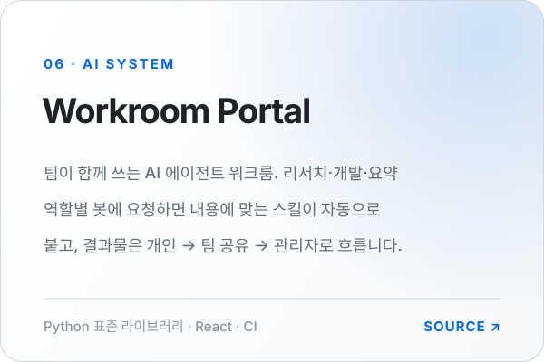
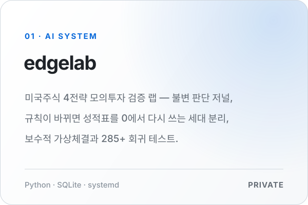
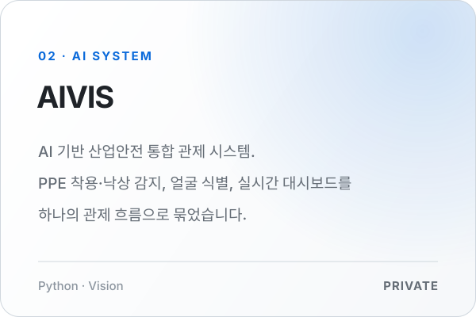
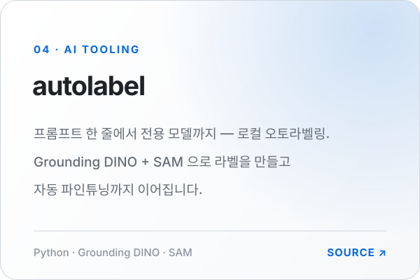
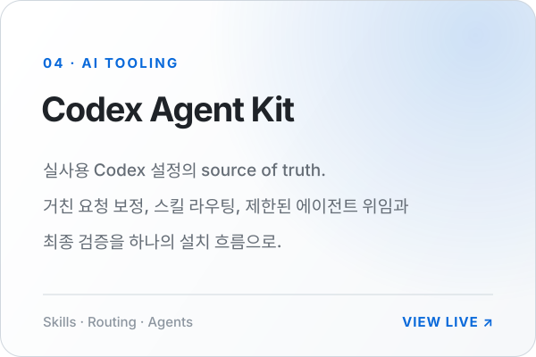
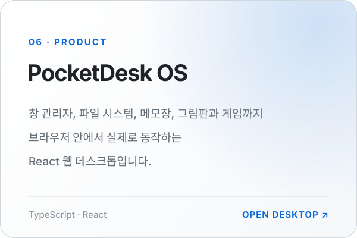
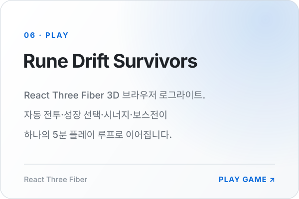

<picture>
  <source media="(prefers-color-scheme: dark) and (max-width: 600px)" srcset="./assets/profile-hero-mobile-dark.svg" />
  <source media="(max-width: 600px)" srcset="./assets/profile-hero-mobile-light.svg" />
  <source media="(prefers-color-scheme: dark)" srcset="./assets/profile-hero-dark.svg" />
  <source media="(prefers-color-scheme: light)" srcset="./assets/profile-hero-light.svg" />
  
</picture>

<p align="center">
  <a href="https://seung-won-yu.github.io/codex-agent-kit/">Codex setup</a>
  &nbsp;·&nbsp;
  <a href="https://seung-won-yu.github.io/pocket-desk-os/">Latest product</a>
  &nbsp;·&nbsp;
  <a href="https://github.com/Seung-Won-Yu?tab=repositories">All projects</a>
</p>

## What I make

아이디어를 설명에만 남겨두지 않고, 직접 만지고 실행할 수 있는 결과물로 만듭니다.
그리고 만든 것이 **정말 동작하는지 스스로 증명하는 구조**까지가 완성이라고 생각합니다.

- **AI systems** — 판단을 기록하고, 규칙이 바뀌면 표본을 버리고, 독립 감사를 반복 투입하는 검증 가능한 자동화
- **Browser-native products** — 설치 없이 바로 경험할 수 있는 인터랙티브 웹 제품
- **Playable experiments** — 짧게 시작해 완성도 있는 플레이 흐름으로 발전시키는 게임 프로토타입

## Selected work

<p align="center">
  <a href="https://github.com/Seung-Won-Yu/workroom-portal-public"><picture><source media="(prefers-color-scheme: dark)" srcset="./assets/cards/00-workroom-portal-dark.svg" /></picture></a>
  <picture><source media="(prefers-color-scheme: dark)" srcset="./assets/cards/01-edgelab-dark.svg" /></picture>
</p>
<p align="center">
  <picture><source media="(prefers-color-scheme: dark)" srcset="./assets/cards/02-aivis-dark.svg" /></picture>
  <a href="https://github.com/Seung-Won-Yu/autolabel"><picture><source media="(prefers-color-scheme: dark)" srcset="./assets/cards/03-autolabel-dark.svg" /></picture></a>
</p>
<p align="center">
  <a href="https://seung-won-yu.github.io/codex-agent-kit/"><picture><source media="(prefers-color-scheme: dark)" srcset="./assets/cards/04-codex-agent-kit-dark.svg" /></picture></a>
</p>
<p align="center">
  <a href="https://seung-won-yu.github.io/pocket-desk-os/"><picture><source media="(prefers-color-scheme: dark)" srcset="./assets/cards/05-pocket-desk-os-dark.svg" /></picture></a>
  <a href="https://seung-won-yu.github.io/rune-drift-survivors/"><picture><source media="(prefers-color-scheme: dark)" srcset="./assets/cards/06-rune-drift-dark.svg" /></picture></a>
</p>

<details>
<summary><b>More experiments</b></summary>
<br/>

- **[Apple Burst](https://seung-won-yu.github.io/apple-burst/)** — 합이 10이 되는 사과를 터뜨리는 캐주얼 게임, Firebase 랭킹 ([source](https://github.com/Seung-Won-Yu/apple-burst))
- **[PangPang Anipang](https://github.com/Seung-Won-Yu/pangpang-anipang)** — React + TypeScript 매치 게임 프로토타입
- **[cart-ocr](https://github.com/Seung-Won-Yu/cart-ocr)** — 장바구니 영수증 OCR 실험
- **[blog-writing](https://github.com/Seung-Won-Yu/blog-writing)** — 뉴스룸 데일리에서 티스토리 초안을 만드는 파이프라인

</details>

## How I work

```text
rough idea → clear scope → working slice → verification in the real thing → documented release
```

빠르게 만드는 것보다, **실제로 동작하고 다시 설명할 수 있는 상태**까지
마무리하는 것을 중요하게 생각합니다.

- 화면이 있는 것은 브라우저에서 직접 조작해 확인하고, 수치가 있는 것은
  손계산과 대조합니다
- 고친 것은 회귀 테스트로 고정합니다 — 같은 결함이 되살아나면 테스트가
  먼저 깨지도록
- 내 코드도 믿지 않습니다 — 맥락 없는 감사자(에이전트·외부 모델)를
  붙이고, 그 발견을 코드 대조로 진짜/헛것 판정해 반영합니다

`TypeScript` · `React` · `Vite` · `Three.js` · `Firebase` · `Supabase` · `Python` · `SQLite` · `systemd` · `GitHub Actions`
